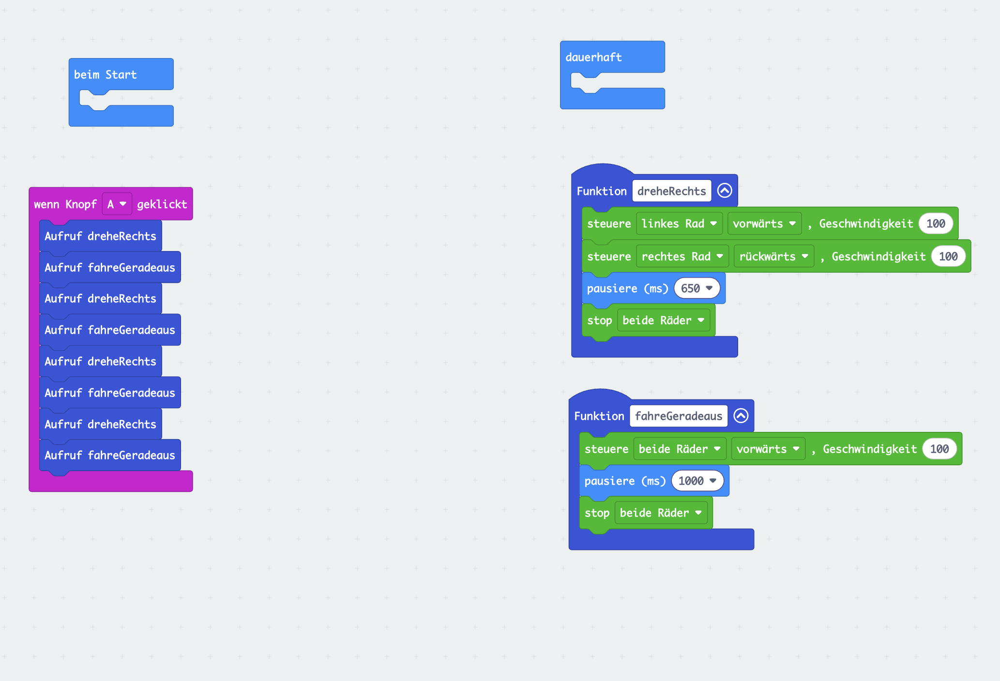

# Station 03 — Fahrschule

Erweiterung geladen, Motorblöcke, erste Fahrt.

## Musterlösung: Quadrat mit Funktionen

Martins Lösung der Quadrat-Challenge (08.10.2026), am Gerät getestet.

- **wenn Knopf A geklickt**: ruft viermal abwechselnd `dreheRechts` und `fahreGeradeaus` auf.
  Der Roboter startet erst auf Knopfdruck, also nicht schon beim Flashen.
- **Funktion fahreGeradeaus**: `steuere beide Räder vorwärts, Geschwindigkeit 100`,
  `pausiere (ms) 1000`, `stop beide Räder`.
- **Funktion dreheRechts**: `steuere linkes Rad vorwärts, Geschwindigkeit 100`,
  `steuere rechtes Rad rückwärts, Geschwindigkeit 100`, `pausiere (ms) 650`, `stop beide Räder`.

Werte: **650 ms** ergeben bei Geschwindigkeit 100 etwa eine 90°-Drehung (Untergrund und
Akkustand verschieben das). Die Hilfe auf der Seite nennt deshalb 500–800 ms.

Funktionen kommen auf der Workshop-Seite nicht vor. Auf der Seite steht als Gerüst die
einfachere Fassung mit `wiederhole 4 mal`. Diese Lösung ist für Betreuende gedacht: Sie zeigen
sie schnellen Teams als Ausblick („einem Stück Programm einen Namen geben“).

Noch nachzureichen: `loesung.hex` (in MakeCode herunterladen und hier ablegen).
